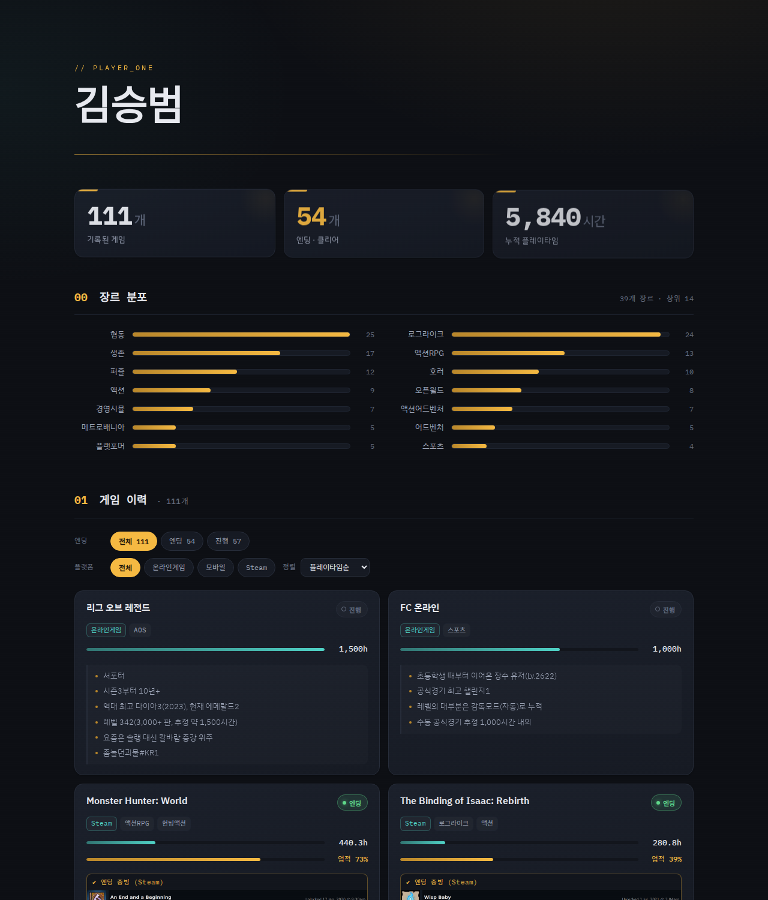

<div align="center">

# 🎮 Playtime Archive

**링크 하나로 증명하는 게임 플레이 이력** — Steam·넥슨·Riot API로 실측하고, 엔딩은 Steam 공식 도전과제 캡처로 검증한 정적 포트폴리오.

[](https://sbkim9704.github.io/playtime-archive/)
[-4fd1c5?style=flat-square)](#-기술-스택)
[](#-데이터-출처--검증)
[](https://pages.github.com/)

<a href="https://sbkim9704.github.io/playtime-archive/">
  
</a>

</div>

---

## 📖 소개

이력서 보조 자료로 만든 **게임 플레이 이력 증명 사이트**입니다. 채용담당자가 링크 한 번으로
플레이 **폭**(장르 다양성)·**깊이**(누적 시간)·**성취**(검증된 엔딩)를 확인할 수 있습니다.

핵심 원칙은 **"주장하지 말고 증명한다"** — 플레이타임·업적률·장르는 API로 실측하고,
엔딩은 조작 불가능한 Steam 공식 도전과제 페이지를 캡처해 카드에 박아 넣습니다.

> 🔢 현재 데이터 — 게임 **111**개 · 검증 엔딩 **54**개(그중 **45**개 Steam 도전과제 캡처) · 누적 **5,840**시간 · **39**개 장르

## ✨ 주요 특징

- **📊 단일 진실 소스** — 모든 화면(요약·차트·카드)이 `games.json` 하나에서 파생
- **🏆 엔딩 증빙** — 각 클리어 게임 카드에 Steam 공식 도전과제 캡처(과제명·달성일시) + 검증 링크
- **🔎 통합 필터** — 엔딩/진행 · 플랫폼 · 정렬(플레이타임/이름/업적률)을 한 테이블에서
- **📈 장르 분포 차트** — 39개 장르를 막대로 시각화해 "장르 불문 폭" 강조
- **📉 데이터 시각화** — 플레이타임 바(시안) · 업적 달성률 바(앰버)를 카드마다
- **📱 반응형** — 데스크톱 2단 카드 ↔ 모바일 단일 열, 가로 스크롤 없음
- **⚡ 무빌드 정적** — 백엔드·번들러·프레임워크 없이 vanilla HTML/CSS/JS

## 🔬 데이터 출처 & 검증

이 프로젝트의 핵심은 **검증 가능성**입니다. 항목별 출처를 투명하게 공개합니다.

| 항목 | 출처 | 검증 방식 |
|---|---|---|
| 플레이타임 | **Steam Web API** `GetOwnedGames` | 실측 (분 단위) |
| 업적 달성률 | **Steam Web API** `GetPlayerAchievements` | 실측 |
| Steam 공식 장르 | **Steam 상점 API** `appdetails` | 실측 (`steam_genres`) |
| **엔딩 증빙** | **Steam 커뮤니티 도전과제 페이지** | 공식 페이지 캡처 + 라이브 링크 |
| FC 온라인 등급 | **넥슨 오픈 API** | 실측 (Lv.2622 · 챌린지1) |
| LoL 티어 | Riot / op.gg | 핸들 공개(`좀놀던괴물#KR1`) |
| 화면 표시 장르 | 직접 큐레이션 | 세부 장르(로그라이크 등) — hover 시 공식 장르 병기 |

> 증빙이 불가능한 소수 엔딩(얼리액세스·co-op 게스트·구 유비소프트작 등)은 **사유를 카드 note에 명시**해
> 숨기지 않고 투명하게 처리했습니다.

## 🛠 기술 스택

- **Frontend** — Vanilla **HTML5 · CSS3 · JavaScript** (ES modules 아님, 단일 스크립트)
- **Fonts** — IBM Plex Sans KR · IBM Plex Mono (Google Fonts)
- **Tooling** — 빌드/번들러 없음. 데이터 수집 스크립트만 Node.js(`node --experimental` 불필요)
- **Hosting** — GitHub Pages (정적)

## 📁 프로젝트 구조

```
playtime-archive/
├── index.html                 # 단일 페이지
├── games.json                 # ★ 데이터 (여기만 수정하면 전체 갱신)
├── assets/
│   ├── app.js                 # 렌더링 로직 (필터·정렬·카드·차트)
│   ├── style.css              # 다크 테마 · 반응형
│   ├── proofs/                # 엔딩 도전과제 캡처 45장
│   └── mobile-proof.png       # 모바일 업적 증빙
├── scripts/                   # (선택) 데이터 수집 헬퍼
│   ├── fetch-steam.mjs               # 소유 게임 + 플레이타임
│   ├── fetch-steam-achievements.mjs  # 게임별 업적률
│   ├── fetch-steam-genres.mjs        # Steam 공식 장르
│   └── fetch-nexon-fc.mjs            # FC 온라인 등급
├── docs/preview.png           # README 미리보기
└── 엔딩증빙-인덱스.md          # 제출용: 엔딩 검증 링크 정리
```

## 🚀 로컬 실행

`fetch()`는 `file://`에서 막히므로 정적 서버로 띄웁니다.

```bash
git clone https://github.com/SBKIM9704/playtime-archive.git
cd playtime-archive
python3 -m http.server 8000
# → http://localhost:8000
```

## ✏️ 데이터 갱신

`games.json`의 `games[]`만 수정하면 화면 전체가 갱신됩니다.

```jsonc
{
  "title": "DAVE THE DIVER",
  "platform": "Steam",              // Steam / 온라인게임 / 모바일
  "genre": ["어드벤처", "경영시뮬"],
  "playtime_hours": 61,
  "cleared": true,                   // 엔딩 여부 = 요약·필터의 기준
  "achievement_pct": 81,             // 업적 달성률
  "notes": ["사실·맥락 항목1", "항목2"], // 배열 · 여러 개면 리스트로 렌더
  "proof": {                         // 엔딩 증빙 (있으면 카드에 이미지)
    "ach": "A Peaceful Blue Hole",
    "date": "2023-08-01",
    "image": "./assets/proofs/1868140.png",
    "url": "https://steamcommunity.com/profiles/.../stats/1868140/achievements"
  }
}
```

**Steam 데이터 자동 수집** (선택):

```bash
# 프로필 공개 → https://steamcommunity.com/dev/apikey 에서 키 발급
STEAM_KEY=xxxx STEAM_ID=7656119... node scripts/fetch-steam.mjs > steam-games.json
```

> ⚠️ API 키는 **커밋 금지** — 환경변수로만 주입.

## 🌐 배포

```bash
git add -A && git commit -m "update" && git push
```

GitHub → **Settings → Pages → Source: `main` / `(root)`** →
`https://<username>.github.io/playtime-archive` 에 자동 게시. 정적 파일뿐이라 워크플로 불필요.

---

<div align="center">
<sub>Built with vanilla JS · Data verified via Steam / Nexon / Riot APIs</sub>
</div>
